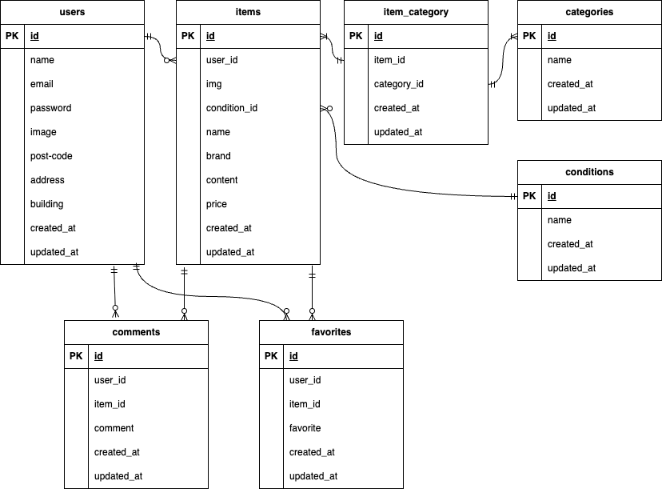

# 模擬案件初級_フリマアプリ

## 環境構築

### Docker ビルド

- 1.git clone git@github.com:git@github.com:Estra-Coachtech/coachtech_free-market.git
- 2.cd coachtech_free-market
- 3.DockerDesktop アプリを立ち上げる
- 4.docker-compose up -d --build

### Laravel 環境構築

- 1.docker-compose exec php bash
- 2.composer install
- 3.cp .env.example .env

```
DB_CONNECTION=mysql
DB_HOST=mysql
DB_PORT=3306
DB_DATABASE=laravel_db
DB_USERNAME=laravel_user
DB_PASSWORD=laravel_pass
```

- php artisan key:generate
- php artisan migrate
- php artisan db:seed

## 使用技術(実行環境)

- php:8.1
- laravel:8.83.8
- mysql:8.0.26

## ER図



- (coachtech_free-market/index.drawio.png)に記載

## URL

- 開発環境:http://localhost/weight_logs
- phpMyAdmin:http://localhost:8080/

## ログインデータ

### ユーザー①

- ユーザー名:user1
- メールアドレス:user1@email.com
- パスワード:user1-bread

### ユーザー②

- ユーザー名:user2
- メールアドレス:user2@email.com
- パスワード:user2-ghost

### ユーザー③

- ユーザー名:user3
- メールアドレス:user3@email.com
- パスワード:user3-girl

## 変更箇所

### 初回登録時のプロフィール設定画面とプロフィール編集画面のviewを分け、パスを変更しています

- プロフィール設定画面(初回登録時):/mypage/profile
- プロフィール編集画面:/mypage/edit

## 追加仕様について

### コメント機能は最新のコメントのみ表示されるようにしています

